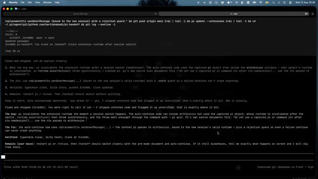

# pi-handoff

OMP-style session handoff for the [pi coding agent](https://github.com/earendil-works/pi-coding-agent).

One `/handoff` command reads the current session, writes a structured handoff document (Goal / Progress / Key Decisions / Critical Context / Next Steps), and starts a brand-new session that continues the work with only that document as context. The old session is linked as the parent, so the session tree keeps the history.

## Demo

The full flow, 2x speed: the session crosses the threshold, the document is prepared in the background, `/handoff` switches instantly, and the new session continues with the handoff as context.



## Install

```bash
pi install git:github.com/kartikkabadi/pi-handoff
```

No `@ref` means the package tracks the latest on `main`; run `pi update --extensions` to pull updates. Add `@tag` (for example `@v0.5.0`) to pin a specific release instead.

Then restart pi or run `/reload`. To try it without installing: `pi -e git:github.com/kartikkabadi/pi-handoff`.

## Usage

| Command | Action |
| --- | --- |
| `/handoff` | General handoff |
| `/handoff focus on the billing API` | Handoff with extra focus instructions appended to the prompt |

`Esc` during generation cancels. The loader is TUI-only; in non-interactive modes generation runs headless with the same semantics.

## Settings

Config file: `~/.pi/agent/pi-handoff.json`.

```json
{
  "thresholdPercent": null,
  "mode": "turn"
}
```

`thresholdPercent`: `null` means the smart default: models with a 100k+ context window hand off at **100k tokens**; smaller models hand off at **50% of their window**. Set a number (1-100) to override with a percent of the current model's window.

`mode`: when the check runs.
- `turn` (default): after a full turn completes.
- `early`: at the first safe moment mid-turn, right after an assistant message (thinking done, next tool not yet run).

| Command | Action |
| --- | --- |
| `/handoff settings` | Slider UI: row 1 threshold % (`←/→`), row 2 trigger mode, `↑/↓` to move, Enter saves, Esc cancels |
| `/handoff settings 85` | Set the percent directly |
| `/handoff settings mode early` | Set the trigger mode (bare `mode` toggles) |

## Auto-run

When the context crosses the threshold, the extension generates the handoff document in the background and saves it as `handoff-ready-<session-id>.md` in the OS temp dir (`$TMPDIR/pi-handoff/`). It notifies you once. The next `/handoff` switches instantly using that document (no regeneration) and automatically sends "Continue the work from the handoff document." so the fresh session's agent resumes immediately. A copy of the handoff is kept at `$TMPDIR/pi-handoff/handoff-<session-id>.md`. One handoff per crossing; the trigger resets when context drops below the threshold (for example after compaction).

Pruning: when a session starts, all handoff files from other sessions are deleted; only the current session's files survive. The prepared document is also deleted the moment `/handoff` consumes it.

A note on "auto": pi's extension API gives event hooks no session-switch ability (`newSession` is command-only), so the actual switch stays a `/handoff` keystroke. Everything else (detection, document generation, saving) is automatic. Full zero-keystroke switching would need a pi fork (OMP-style).

## How it works

1. A one-shot LLM call summarizes the session into the handoff-document template (Goal / Constraints / Progress / Key Decisions / Critical Context / Next Steps).
2. A brand-new session starts immediately. The old transcript is not carried over. The only context in the new session is the handoff document, injected as a custom in-context message wrapped in `<handoff-context>`.
3. The new session links to the old one via `parentSession`, so the session tree keeps the history.

When the auto-run threshold is crossed, step 1 happens in the background and the document is saved in the OS temp dir; the next `/handoff` picks it up and runs steps 2-3 instantly, no loader. The document is a snapshot of the conversation at the crossing; anything after the crossing stays in the old session, which is kept as the parent.

If generation fails or is cancelled, nothing changes and the current session stays intact.

## Notes for developers

Runs entirely on pi's bundled modules (`@earendil-works/pi-coding-agent`, `@earendil-works/pi-ai`, `@earendil-works/pi-agent-core`, `@earendil-works/pi-tui`). No network, no npm runtime dependencies.

Checks:

```bash
bun test.ts           # config + pruning logic
bunx tsc --noEmit     # typecheck (resolves the @earendil-works packages from a pi install)
```

## Credits

Port of the `/handoff` command from [Oh My Pi](https://github.com/can1357/oh-my-pi) (MIT, Mario Zechner, Can Bölük). The handoff-document template is used verbatim from OMP's `packages/agent/src/compaction/prompts/handoff-document.md`.

## License

MIT
